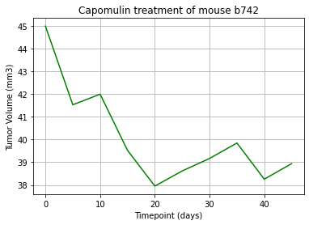

# Matplotlib-challenge
 
 In the recent animal study, the complete data set for 249 tested subjects identified with squamous cell carcinoma (SSC) was used to analyze and compare the performance of the drug of interest Capomulin versus the other treatment regiment The time to observe and measure tumor development was 45 days.
 The data for one mouse found with duplicate timepoints were removed, and the dataset was analyzed for 248 tested subjects.

Summary statistical methods are used to calculate the following properties of each drug regimen - mean, median, variance, standard deviation and standard error of the mean (SEM) of the tumor volume. For four of the treatment regimens - Capomuline, Ramicane, Infubinol, and Ceftamin the additional properties were calculated - quartiles, interquartile range (IQR) and also the possible outliers were determined.
To provide a visualization of the results in this study bar and pie charts were displayed.  For Capomulin regimen the data are used to plot line and scatter plots. The correlation coefficient and linear regression model are also shown for data analyzed for Capomulin regimen.
 

